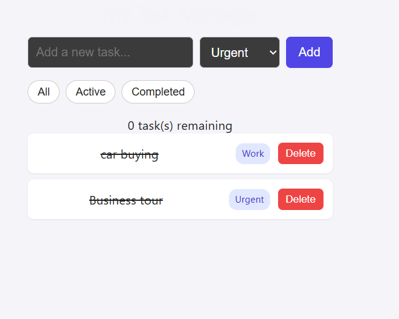
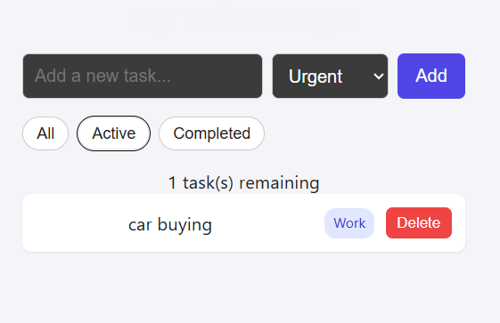
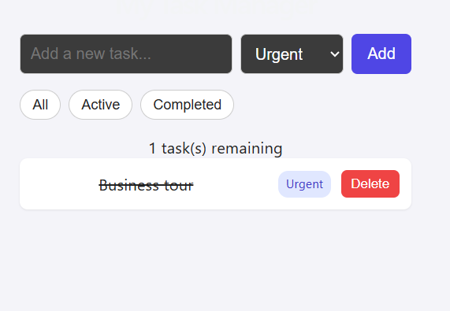

# My Task Manager

A simple, responsive task management app built with React. It lets users add, organize, and track their daily to-dos with categories, filtering, and persistence, so tasks are never lost on refresh.

## Features Implemented

- Add new tasks with a title and category (Personal, Work, Urgent)
- Mark tasks as complete/incomplete by clicking on them
- Delete tasks
- Filter tasks by status: All / Active / Completed
- Live count of remaining (incomplete) tasks
- Tasks persist automatically using localStorage, so they survive a page refresh
- Empty state message shown when a filter has no matching tasks
- Responsive layout that adapts to both desktop and mobile screen widths

## Technologies / Libraries Used

- React (functional components + hooks)
- Vite (build tool and dev server)
- Plain CSS (no external UI library)
- Git & GitHub for version control

## Project Structure

- `src/components/TaskForm.jsx` - input field, category dropdown, and Add button
- `src/components/TaskItem.jsx` - a single task row
- `src/components/TaskList.jsx` - renders the list of TaskItem components
- `src/components/FilterBar.jsx` - filter buttons and remaining count
- `src/App.jsx` - holds app state and logic
- `src/App.css` - all styling

## Setup Instructions

1. Clone this repository: `git clone https://github.com/bikashshah056-rgb/task-manager.git`
2. Move into the project folder: `cd task-manager`
3. Install dependencies: `npm install`
4. Start the development server: `npm run dev`
5. Open the link shown in the terminal (usually `http://localhost:5173`) in your browser.

## Screenshots

**All tasks view**

**Active tasks view**

**Completed tasks view**

## Known Limitations

- There is no dedicated "edit" feature; a task must be deleted and re-added to change its wording.
- No drag-and-drop reordering of tasks.
- No due dates or overdue indicators.
- No dark/light theme toggle.